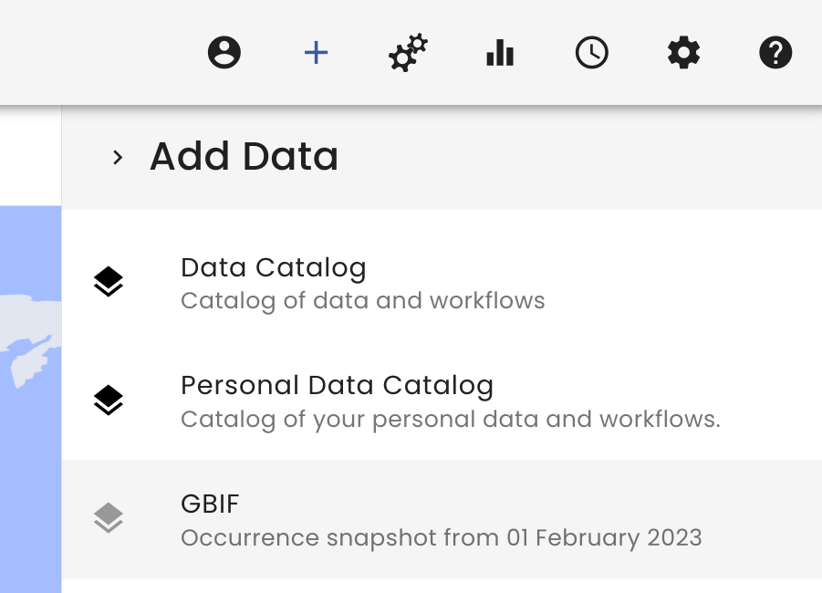
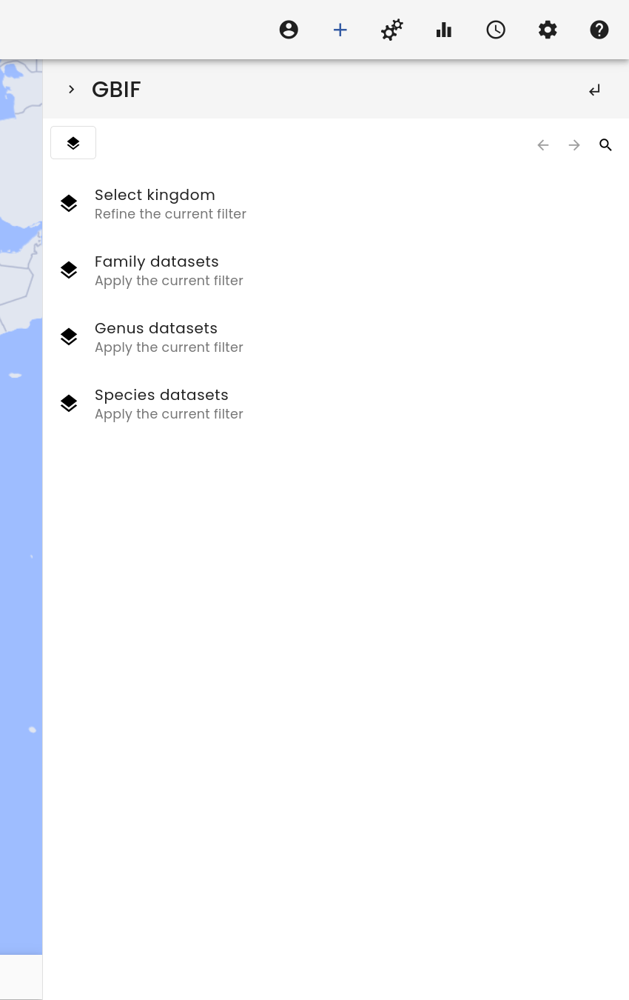
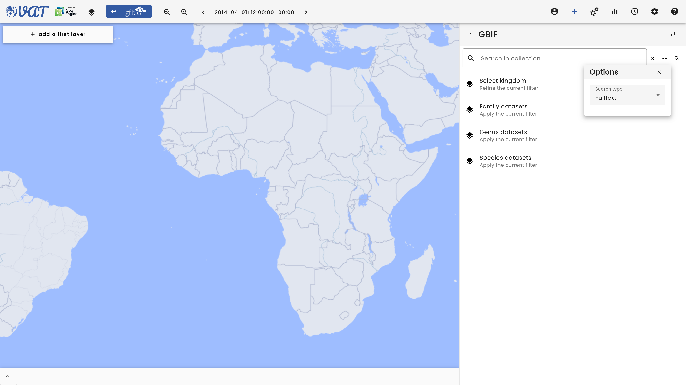

# GBIF Search

The VAT system provides access to regular dumps of the GBIF occurrence data.
This allows users to easily access GBIF data without having to download the data themselves.
In addition, they can map the data together with other data sources in the VAT system.

The GBIF data are made available as a data provider, which can be selected in the data menu (+).
There, VAT groups the GBIF occurrences by different taxonomic ranks, e.g. family or species.
Selecting such data will load all occurrence records from different datasets that fall under this taxonomic rank, e.g. all occurrences of the Genus Abedus (water bug).

While users can browse lists of taxonomic ranks, they can also search for specific taxa.
This makes it much easier to find the data of interest when specific taxa are known.
At the top of the GBIF catalog, users can find the search icon on the right-hand side.
Clicking on it brings up a search bar where users can enter the name of the taxon of interest.
By typing in a few letters of the taxon name, VAT will suggest possible names that can be selected if they seem appropriate.
Clicking the search icon again, or pressing ENTER, will display a list of search results.

Users can also change the default search settings by clicking the options icon next to the search icon.
This opens a dialog that allows users to change the default search settings, such as the search type.
The _Fulltext_ search matches the term anywhere in the name, while the _Prefix_ search matches only the beginning of the name.
In addition, users can filter their results by taxonomic rank, e.g., show only results that are of the rank Species.
This can be done by first selecting one of the collections, e.g., _Species datasets_, and then performing the search.

<video controls>
  <source src="media/gbif-search.mp4" type="video/mp4" />
</video>

At all browsing levels, the current filter, if selected, is respected also during a search.
This is an additional upgrade to a previous version of the search where you could only search for family, genus, or species.
Now you can, for example, filter for a specific kingdom and order beforehand and already reduce the amount of search results by combining hierarchical browsing and searching.
