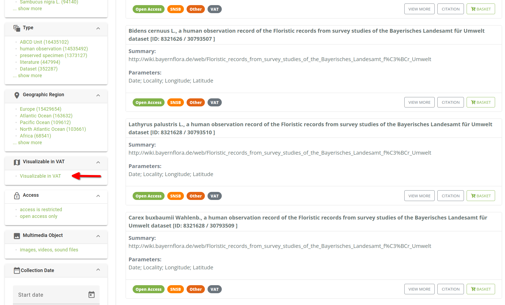
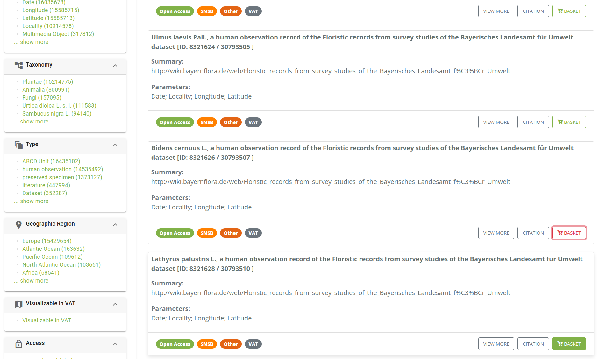
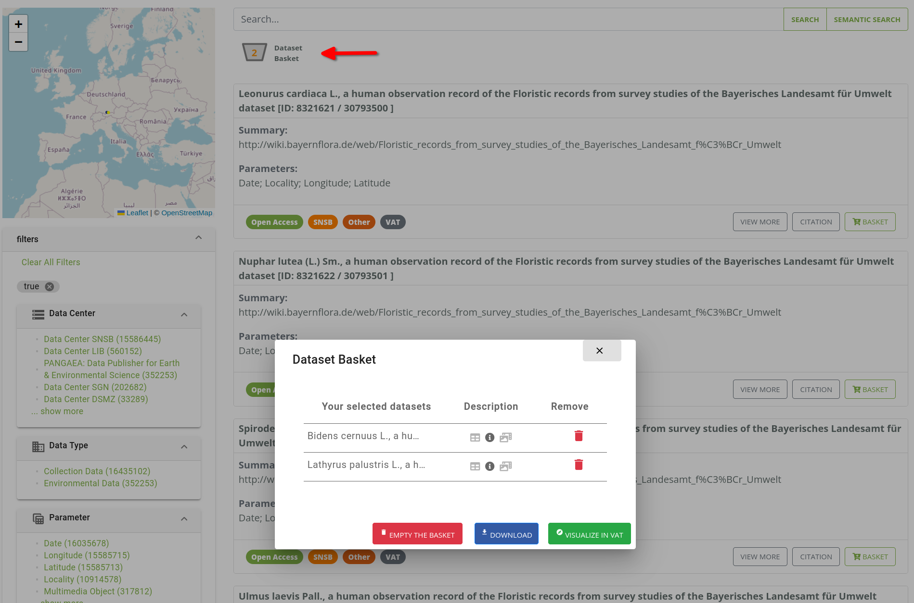
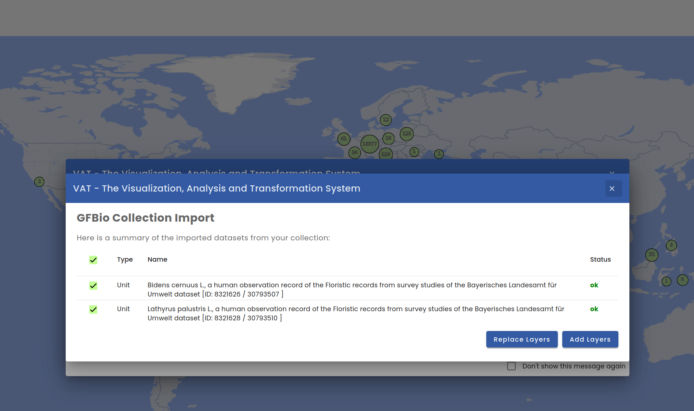
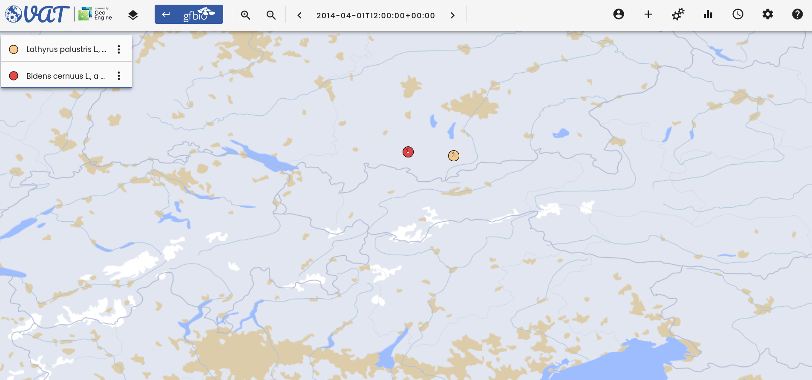

# Search Integration

The VAT system provides a search integration with the [GFBio search](https://search.gfbio.org/) that allows users to transfer search results directly to the VAT system.

## Searching for data

To search for data, users can enter a search term in the search bar and press the `Enter` key.
This will show the search results.
Users can filter the search results by selecting _Visualizable in VAT_ in the menu on the left side.
This will show only the datasets that can be visualized in the VAT system.

## Search baskets

Users can add search results to the basket by clicking on the `Basket` button.
This will add the data to the basket.

## Transferring data to VAT

Users can transfer the data from the basket to the VAT system by opening the search basket.
This will show all datasets that are in the basket.
Users can select the datasets they want to transfer to the VAT system and click on the `Visualize in VAT` button.

## Adding layers to the map

This will open a dialog in the VAT system where users can select the layers they want to add to the map.
Users can choose the layers they want to add and if they should replace the current layers or add the new layers on top of the current layers.

The selected layers will be added to the map in the VAT system.
Users can now work with the data as they would with any other data in the VAT system.
