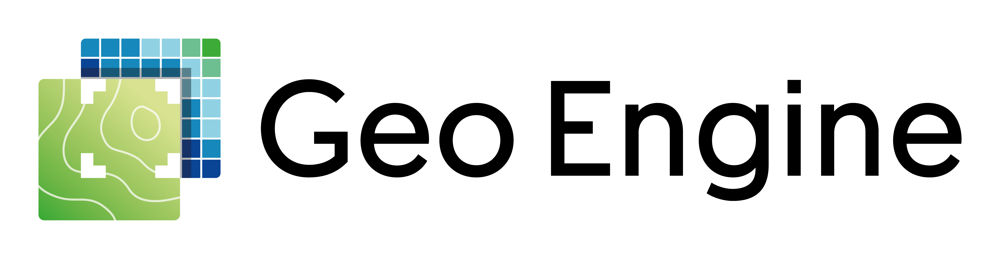

# The Geo Engine

## What is the Geo Engine?

Geodata, i.e.
data relating to location and time, is omnipresent.
The amount of data is constantly increasing.
Geodata portals play a key role in the dissemination and utilization of geodata.
They typically run in the cloud and users only need a browser to be able to use them.
Although portals are sometimes highly specialized, there are requirements for the underlying software that are common to all portals.
Data access, data processing and visualization must always be implemented.
The Geo Engine provides all the components required to build geodata portals.
It consists of a back end for processing and a front end with components that can be freely combined in portals.

The Geo Engine is also a geographic information system (GIS) that makes it possible to process data.
Experts can use it to create workflows that generate a result from source data and processing steps.
One example is linking animal observations to a temperature layer and filtering by average temperature to find animals that can cope well with the cold.
Once an interesting workflow has been found, a portal can be created that can be used intuitively without prior knowledge.
The Geo Engine portals go far beyond static maps.
They enable interactive analyses so that the data can be freely explored.
Users can also contribute their own data and merge it with the portal data after uploading it.
For example, a user can upload GPS positions of a route to the portal and visualize the development of portal data along this route.

## What are its components?

The Geo Engine consists of a backend, which usually runs on a server and provides data and functions for various frontends.
The two front ends that belong to the Geo Engine are the web UI and the Python library.
In addition, external tools can also communicate directly with the backend via standard interfaces.

The web UI enables the Geo Engine to be used in the browser.
The elements of the Web UI can be combined to create various applications.
The Geo Engine GIS offers the greatest flexibility, but requires a training period and specialist knowledge due to the wide range of functions.
Dashboards, on the other hand, are aimed at a broader user group.
They are specialized portals that focus strongly on one application and are easier to use due to predefined analyses.
The Geo Engine comes with ready-made dashboards and allows you to build new dashboards from existing components.

The Python library is aimed at users with programming skills who want to process data outside of the Geo Engine.
For example, it is possible to create more complex diagrams or use machine learning.
In addition, the Geo Engine can also be administered via Python by activating further functionalities for data and user administration via an admin token.

The Geo Engine is based on standard software.
The backend uses GDAL, PROJ and Apache Arrow, among others.
The front end is based on Angular and OpenLayers.
Docker containers are available for the installation and operation of the Geo Engine.
There is one container image each for the backend and frontend.
Together with external components such as a PostgreSQL database, these can be bundled in a pod and provided as a separate instance.

## Can everyone install the Geo Engine?

The Geo Engine can be used at a very low threshold, as there are publicly accessible instances that run in the cloud and do not require installation.
Examples include the GFBio VAT system at https://vat.gfbio.org and the EBV Analyzer at https://portal.geobon.org/map.
In addition to these portals, which are based on the Geo Engine and offer more or less functions, there will also be a demo of the Geo Engine GIS in the future, which will be available at https://www.geoengine.io.

The Geo Engine can also be installed on your own systems and hosted yourself.
It is then provided via Docker and requires certain IT expertise.
Geo Engine GmbH also offers hosting and support on request.

The Geo Engine is made available under an open core license.
This is a mixture of open-source and freely usable software with certain paid functions.
All essential functions are available free of charge.

## How does the Geo Engine differ from similar products such as MapServer, GeoServer or GeoNode?

In the world of geodata processing, there is a huge amount of software with very different focuses.
MapServer and GeoServer are server software that provide geodata via web services for maps.
GeoNode is a data management platform that is based on GeoServer, among other things.
It enables users to create, share and publish interactive maps.
The Geo Engine goes far beyond this functionality and makes it possible to create analyses in the platform itself using an operator toolbox and workflow engine.
Based on these workflows, specialized dashboards and portals can then be created that are easy for users to operate.

## How is the Geo Engine used in NFDI4Biodiversity?

NFDI4Biodiversity contains a great deal of geodata, i.e.
data that has a spatial and temporal reference.
One example is the locations of collections in a herbarium, which can have a time of discovery and GPS coordinates.
It is important for the scientific community to be able to find and use this data as easily as possible.
The Geo Engine can be seen as a toolbox for creating geo-applications within the framework of NFDI4Biodiversity.

In detail, there are two points of contact in NFDI4Biodiversity, namely the GFBio portal and user portals.
GFBio is a sub-project that brings together data from German collections and data centers in the field of biodiversity and offers a point of contact for researchers.
The Geo Engine can be accessed via the GFBio search, from which selected data can be visualized in a web GIS in the browser, where GIS stands for Geographical Information System.
In addition, the Geo Engine can be used to perform GIS operations directly on the data without having to have expert knowledge or install software.
One example is the linking of environmental data, e.g.
temperature models, which are offered by the Geo Engine in addition to the GFBio data, with plant locations.
The actually complicated work of linking two time series of different geodata is automatically taken over by the Geo Engine.
The data can in turn be visualized using maps, tables or plots or downloaded for further use.

In addition to the GFBio portal, there is also a proof-of-concept in which data portals based on the Geo Engine and some special data sets from NFDI4Biodiversity were created for specific specialist communities.
Here, dashboards were built on the basis of the Geo Engine that are precisely tailored to the needs of individual user groups.
These then offer selected functions with intuitive, coordinated usability.

## Where else is the Geo Engine used?

The Geo Engine is used in very different scenarios.
In the area of data portals, it implements the connection, visualization and analysis of geodata.
Specifically, it is the technological basis of the Terranova portal, which is building a digital atlas of Europe.
In the GEO BON EBV Data Portal, it enables the exploration of and access to Essential Biodiversity Variables, which provide indicators for the development of global biodiversity.

In research, the Geo Engine is used to connect complex data sets, implement special algorithms and implement analysis workflows.
It is used in the RESPECT project, which is investigating environmental changes in tropical mountain forests in southern Ecuador.
In CropHype, it provides the basis for improving the classification of agricultural fields using new types of satellite data.

One use case from industry is the enrichment of proprietary data with publicly available data that is difficult to obtain and process.
A concrete example is the calculation of vegetation indicators, a measure of how densely overgrown an area is.
Here, the Geo Engine procures the necessary satellite data, calculates the vegetation and links it to the company data.
The results are made available via standard interfaces so that they can be integrated into company processes.

## More information

- [Geo Engine Gmbh](https://geoengine.io/)
- [Geo Engine Documentation](https://docs.geoengine.io/)
