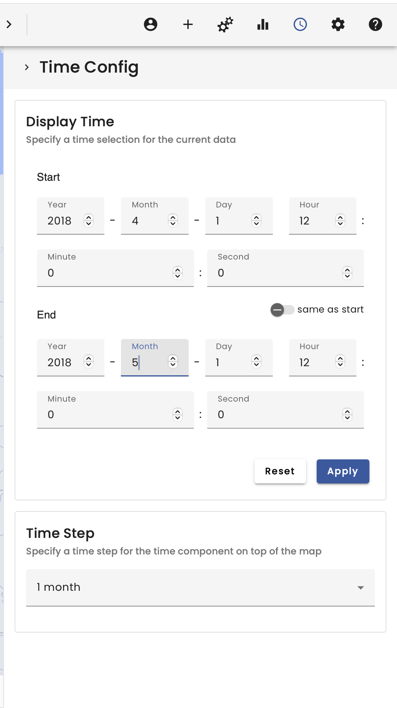
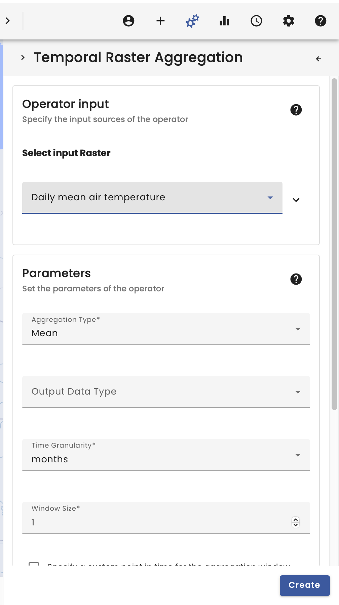

# On Dry Land

**++ Currently, this example is being reworked after the latest update because GBIF behaves differently now. [Find out more](/updates/updates_and_changes.html). ++**

## Video

<iframe width="560" height="315" src="https://www.youtube.com/embed/MvkQl973kZI" frameborder="0" allow="accelerometer; autoplay; encrypted-media; gyroscope; picture-in-picture" allowfullscreen></iframe>

## Summary

Welcome to the Dry Land Use Case.

In this example, the GBIF occurrence data of *Calopteryx splendens* are clipped to the extent of Germany and merged with the land use classification from the IÖR land use classification as well as aggregated temperature data provided by the German weather service (DWD).

To begin, we select the Data Catalogue in the top right-hand corner. Here we have several data catalogues to choose from.

In our case we start by searching for _Calopteryx splendens_ in the GBIF data provider. The search function makes it easy to find the species, so we can search for _Calopteryx splendens_ and load the dataset by selecting it.

For the spatial selection we also need the German border, which we found by searching for _Germany_ in the data catalogue.

Next, for the join between the occurrence data and the average temperature, we search for the _Daily mean air temperature_ dataset in the data catalogue.

**Caution**: The _Daily mean air temperature_ is a spatio-temporal dataset. Always check the spatial and temporal extent in the metadata.

The *Daily mean air temperature* dataset covers Germany with a time range from 1951/01/01 to 2021/01/01 in a daily resolution. To see an effect on the data it is recommended to change the time in the time menu at the top right due to the high spatiotemporal resolution of the temperature data.

In order to join the occurrence data with the land use classification, it is also necessary to load the _IÖR Landschaftsklassifikation_ by searching for it in the data catalogue.

The next step takes place in the Operators section, located in the top right-hand corner.

First we use a _Point in Polygon Filter_ to restrict our occurrence data to Germany. For better readability it is recommended to name the datasets.

As the Daily mean air temperature has such a high temporal resolution we want to convert it into a more handleable and more interpretable monthly time resolution using the _Temporal Raster Aggregation Operator_.  

Next, we join the raster data to the vector data using the _Raster Vector Join Operator_, which takes the occurrence data as a vector and the IÖR Landschaftsklassifikation and Monthly mean air temperature as raster data.

The result is that the vector data is spatially joined to the raster data by position. Therefore, new columns are added to the vector data table containing the information.

The _Histogram_ operator can be used to visualize the distribution of occurrence data as a function of average temperature.

To visualize the classified data, it is recommended to use the _Class Histogram_ operator, which translates the IÖR land classification numbers into class names using the metadata.

The plots then show the distribution of occurrences of _Calopteryx splendens_ as a function, firstly, of the average temperature on 1 January 2000 and, secondly, of the land-use classification of the IÖR Landklassifikation. Now the time selection menu at the top can be used to observe the change between the observation and the temperature and land use classification over the course of the year. Please note that the land classification does not change over time, only the species occurrences. 

**Warning**: The VAT system is designed primarily for data exploration. Changing the extent of the visual map will recalculate the workflow and could change the results! This must be taken into account when working scientifically with the VAT system. There is also a new window in the bottom left corner. This window must be present when working scientifically with the VAT system, as it allows reproducibility!

**Tip**: The layers have several options. They can be downloaded to work with the data in other systems. The layers also always have a workflow tree and the _workflow_id_ can be copied to import the workflow directly into Python.
