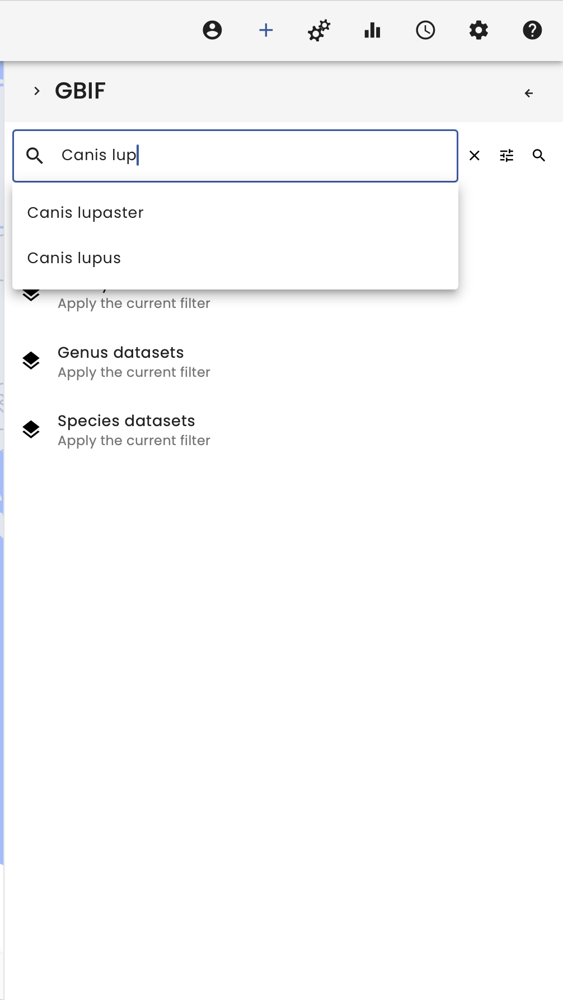
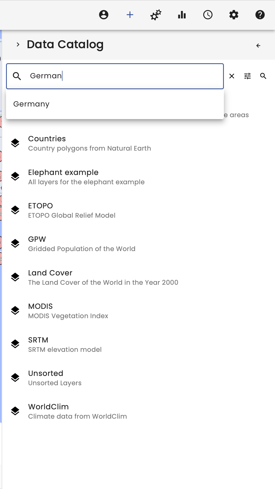
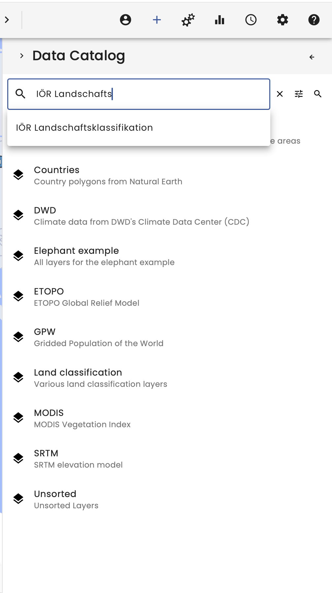
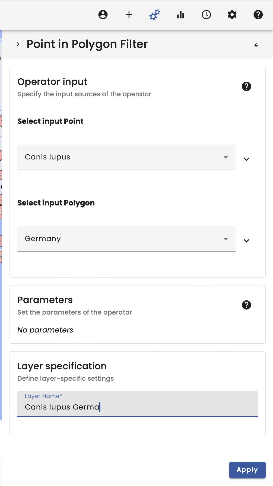
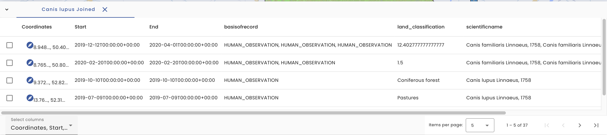
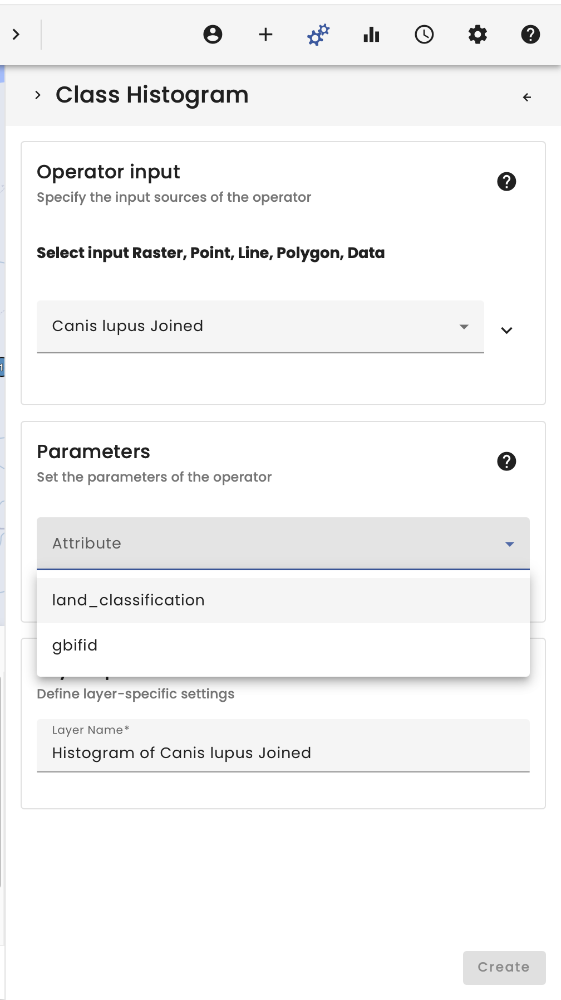

# Canis lupus meets Felis silvestris

## Video

<iframe width="560" height="315" src="https://www.youtube.com/embed/Rdu98FGIiGg" frameborder="0" allow="accelerometer; autoplay; encrypted-media; gyroscope; picture-in-picture" allowfullscreen></iframe>

## Summary

Welcome to the Canis lupus meets Felis silvestris use case.

In this example the GBIF occurrence data of Canis lupus and Felis silvestris are cut to the extent of Germany and linked to the land use classification of the Ecosystematlas.

To begin, we select the Data Catalogue in the top right-hand corner. Here we have several data catalogues to choose from.

In our case, we start by searching for the individual species in the GBIF data provider. The search function makes it easy to find the species, so we search for _Canis lupus_ and load the dataset by selecting it.

For the spatial selection we also need the German borders, which we found by searching for _Germany_ in the data catalogue.

In order to link the occurrence data with the land use classification, it is also necessary to load the _Oekosystematlas_ by searching for it in the personal data catalogue. The personal data catalogue contains all datasets uploaded by the user as well as a section with _all datasets_, which also contains datasets not listed.

The next step takes place in the Operators section, located in the top right-hand corner.

First we use a _Point in Polygon Filter_ to restrict our occurrence data to Germany. For better readability it is recommended to name the datasets.

Next, we join the raster data to the vector data using the _Raster Vector Join Operator_, which takes the occurrence data as a vector and the Ecosystem Atlas as raster data.

The result is that the vector data is spatially linked to the raster data by position. Therefore, a new column is added to the vector data table containing the information.

To visualise the classified data, it is recommended to use the _Class Histogram_ operator, which translates the Ecosystem Atlas numbers into class names using the metadata.

The graph then shows the distribution of occurrences according to class.

Using the same procedure for _Felis silvestris_, it is possible to compare the occurrence of the two species.

**Warning**: The VAT system is mainly used for data exploration. Changing the extent of the visual map will recalculate the workflow and could change the results! This must be taken into account when working scientifically with the VAT system. There is also a new window in the bottom left corner. This window must be present when working scientifically with the VAT system, as it allows reproducibility!

**Tip**: The layers have several options. They can be downloaded to work with the data in other systems. The layers also always have a workflow tree and the _workflow_id_ can be copied to import the workflow directly into Python.

