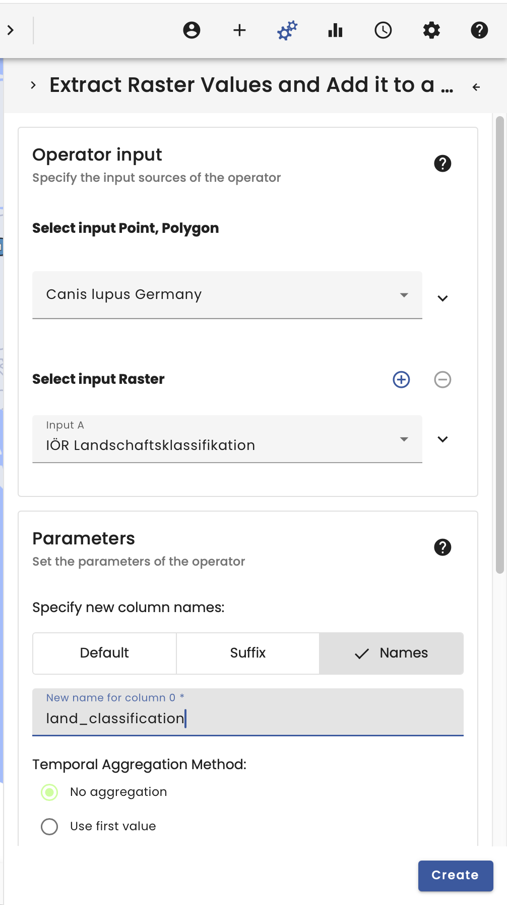

# *Canis lupus* meets *Felis silvestris*

**++ Currently, this example is being reworked after the latest update because GBIF behaves differently now. [Find out more](/updates/updates_and_changes.html). ++**

## Video

<iframe width="560" height="315" src="https://www.youtube.com/embed/Rdu98FGIiGg" frameborder="0" allow="accelerometer; autoplay; encrypted-media; gyroscope; picture-in-picture" allowfullscreen></iframe>

## Summary

Welcome to the *Canis lupus* meets *Felis silvestris* use case.

In this example the GBIF occurrence data of *Canis lupus* and *Felis silvestris* are filtered to the extent of Germany and joined to the land use classification of the IÖR land use classification.

To begin, we select the Data Catalogue in the top right-hand corner. Here we have several data catalogues to choose from.

In our case, we start by searching for the individual species in the GBIF data provider. The search function makes it easy to find the species, so we search for _Canis lupus_ and load the dataset by selecting it.

For the spatial selection we also need the German borders, which we found by searching for _Germany_ in the data catalogue.

In order to join the occurrence data with the land use classification, it is also necessary to load the _IÖR Landschaftsklassifikation_ by searching for it in the data catalogue. 

The next step takes place in the Operators section, located in the top right-hand corner.

First we use a _Point in Polygon Filter_ to restrict our occurrence data to Germany. For better readability it is recommended to name the datasets.

Next, we join the raster data to the vector data using the _Raster Vector Join Operator_, which takes the occurrence data as a vector and the IÖR Landschaftsklassifikation as raster data.

The result is that the vector data is spatially joined to the raster data by position. Therefore, a new column is added to the vector data table containing the information from the raster/the raster value. The float values are the result of the clustering calculating the mean of all integer encoded classes in classified data. This won't reflect in the downloaded data.

To visualise the classified data, it is recommended to use the _Class Histogram_ operator, which translates the IÖR Landschaftsklassifiation numbers into class names using the metadata.

The graph then shows the distribution of occurrences according to class.

Using the same procedure for _Felis silvestris_, it is possible to compare the occurrence of the two species.

**Warning**: The VAT system is mainly used for data exploration. Changing the extent of the visual map will recalculate the workflow and could change the results! This must be taken into account when working scientifically with the VAT system. There is also a new window in the bottom left corner. This window must be present when working scientifically with the VAT system, as it allows reproducibility!

**Tip**: The layers have several options. They can be downloaded to work with the data in other systems. The layers also always have a workflow tree and the _workflow_id_ can be copied to import the workflow directly into Python.
