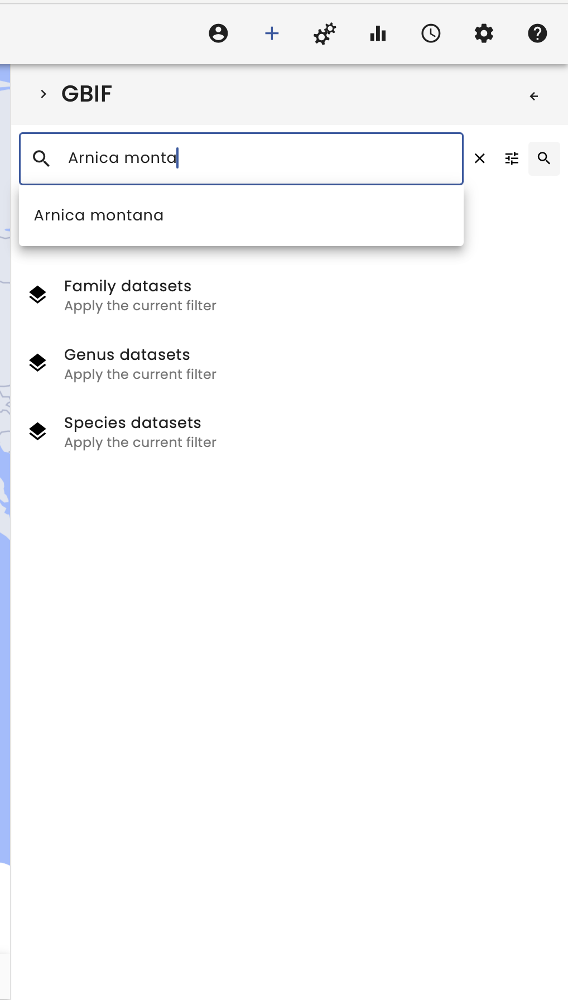
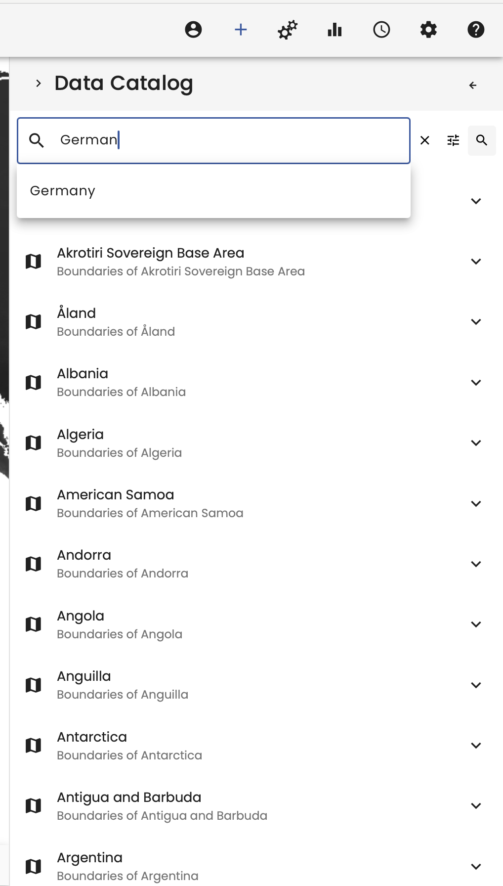
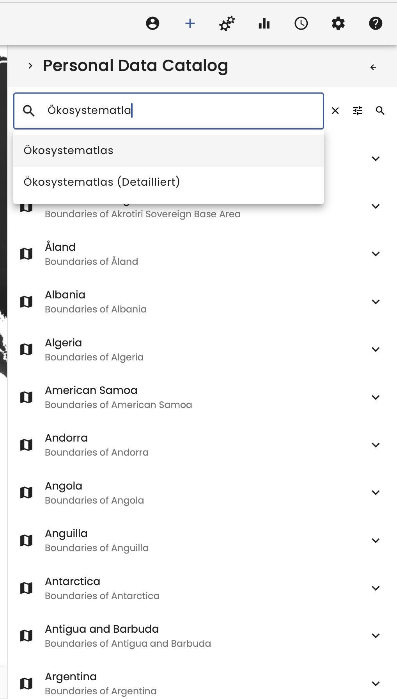
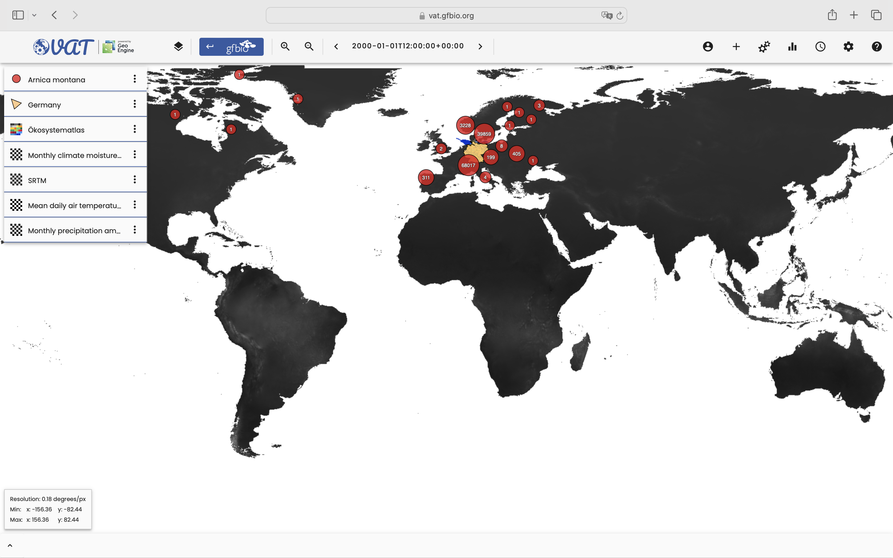
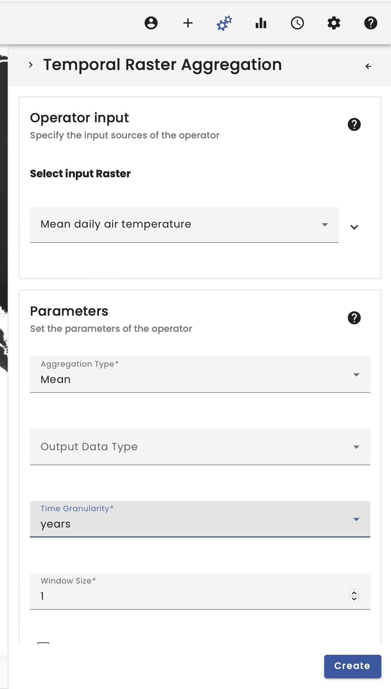
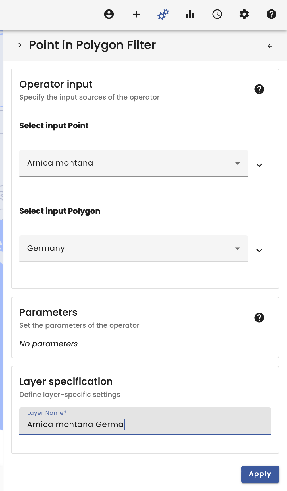
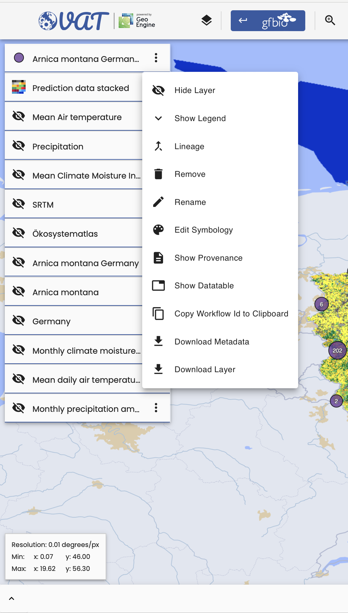
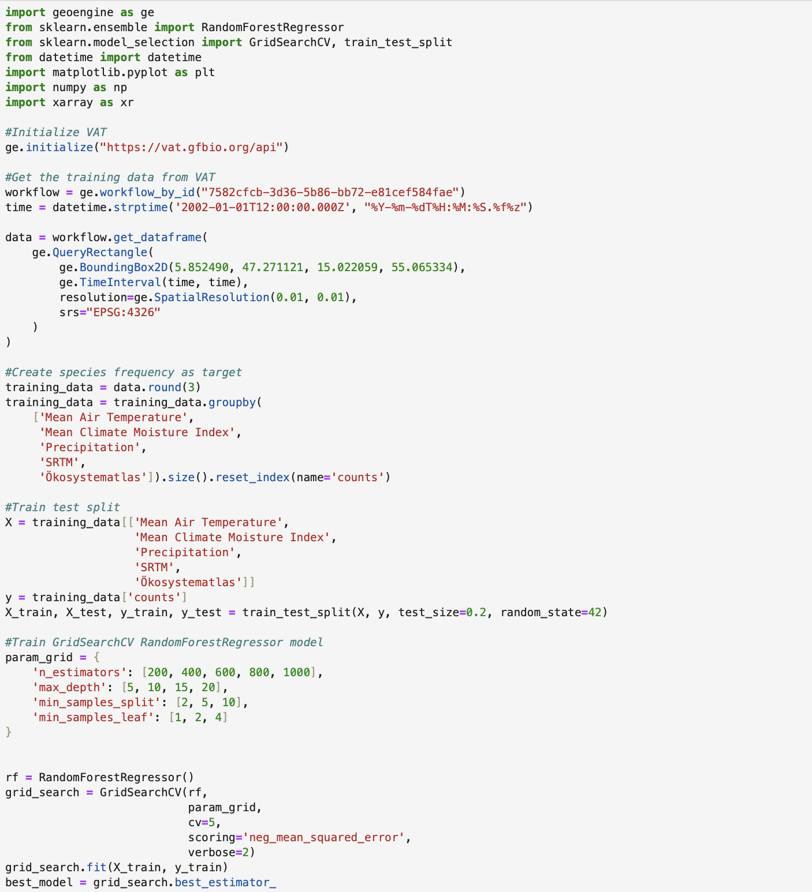
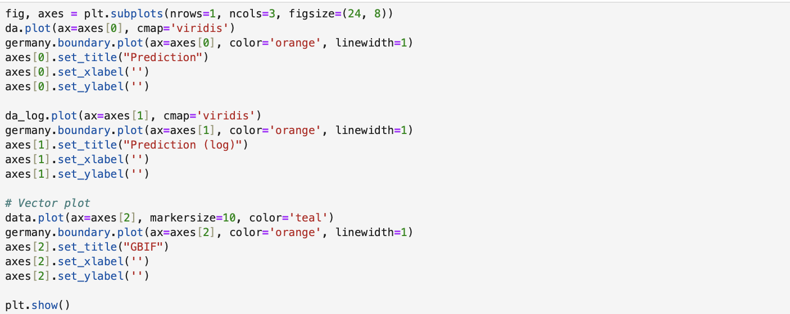

# VAT 4 ML - Creating Training data for a species distribution model

This workflow is a contribution to the NFDI4Earth conference.

## Video

The video for this use case is coming soon!

## Summary

Welcome to the VAT 4 ML Use Case.

In this example we will label training data in VAT for Germany, transfer it to a Jupyter notebook using the unique workflow identifier, download the training data as a geodataframe and finally use a machine learning model to build a species distribution model.

For this use case, we will therefore use the frequency of *Arnica montana* occurrences from GBIF as the target variable together with weather data from *CHELSA*, land use classification from *Ökosystematlas* and topographic information as predictor variables.

To begin, select the Data Catalogue in the top right-hand corner. Here we have several data catalogues to choose from.

In our case, we start by searching for the individual species in the GBIF data provider. The search function makes it easy to find the species, so we search for _Arnica montana_ and load the dataset by selecting it.

For the weather data we taking weather information from *CHELSA*. Here we choose the *Mean daily air temperature*, *Monthly moisture index* and the *Montly precipitation amount*.

**Caution: The weather data is a spatio-temporal data set. Always check the spatial and temporal extent in the metadata.

The weather datasets cover the whole earth and a time range from 01/01/1981 to 01/01/2011. We need to change the time in the time menu at the top right.

For the spatial selection we also need the German borders, which we found by searching for _Germany_ in the data catalogue.

To add topographic information to the predictor variables, we include the *SRTM* elevation model.

Finally, we add land use classification data, which in this case is the *Oekosystemaltas*. It can be loaded by searching for it in the personal data catalogue. The personal data catalogue contains all the datasets that the user has uploaded, as well as a section with all datasets, which also contains datasets that are not listed.

This gives us all the layers we need to create the training and prediction data.

We start to create the training data and prepare the prediction data by aggregating the spatio-temporal weather data. To do this, we use the *Temporal Raster Aggregation* operator. This allows us to aggregate temporal data by a moving window (i.e. 1 year). We use this operator for all weather data. While we choose the mean aggregation type for the temperature and the moisture index, we choose the sum aggregation type for the precipitation. For better readability it is recommended to name the datasets.

In a second step, we spatially filter the GBIF occurrence data of *Arnica montana* using the _Point in Polygon Filter_ to restrict our occurrence data to Germany. 

.

Finally, to create the training data, we join the prepared raster data to the vector data using the _Raster Vector Join Operator_, which takes the occurrence data as a vector and the other prepared raster data. This allows us to spatially join the occurrences with the value of the underlying raster cells.

To create the prediction data, we then use the *Raster Stacker* operator to create a multi-layer raster containing all the raster data. This makes it easier to import it into Jupyter Notebook and work with it.

This brings us to the *Arnica montana* training data and the stacked prediction grid data.

We now copy the Workflow ID for each layer to use in Jupyter Notebook.

In Jupyter Notebook, we can use the geoengine package to first initialise the VAT API. We then import the training data workflow. We then round and group the data in Jupyter Notebook to create a frequency of *Arnica montana* occurrences for each predictor variable combination. The frequency is used as the target variable and the remaining columns are used for the predictor variables. We then split the dataset into training and test data and start training the RandomForestRegressor model using a GridSearchCV strategy for better results. The best resulting model has an r2 value of 0.07.

After model training we can import the prediction data workflow. The best RandomForestRegressor model is used for the final prediction 

Finally, the result is plotted using the matplotlib package.

Although the model did not show the best performance, it was possible to show how easy it is to create spatio-temporal training data for machine learning applications using the VAT and exporting the data directly into Python, where it can be used in typical formats such as geopandas GeoDataFrame or xarray DataArray. 