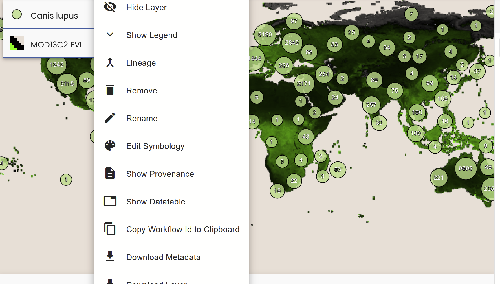
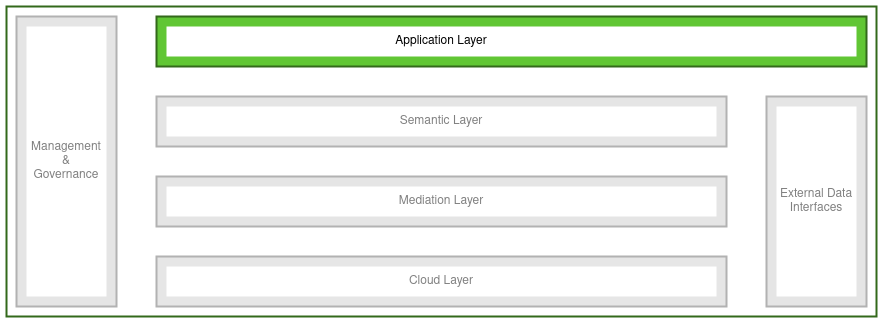

# The VAT System

| Service                                | Status     |
| -------------------------------------- | ---------- |
| [vat.gfbio.org](https://vat.gfbio.org) | Productive |

## Overview

The VAT system allows users to visualize geospatial data on a map in their browser and work with it interactively.
Data and processing is provided by the Geo Engine backend service running in the Semantic Layer.
The VAT system lists all data products available at the Geo Engine backend service as layers, which can be selected for visualization on the map.
Layers can be combined and transformed interactively by constructing arbitrarily complex workflows, which themselves are visualized as new layers on the map or can be plotted, e.g., as a bar chart, right next to the map.
This facilitates an interactive approach to constructing new data products and analyzing them.

## RDC Integration

The VAT system is served as a fully containerized application from the de.NBI cloud and is connected to the Geo Engine Backend service running in the Semantic Layer.

## Getting started

To become familiar with the VAT system, take a look at the publicly accessible instance, which has several biodiversity research related datasets available.

You can run through the following example to get a first impression on what is possible with the VAT system. In the example, you will take elephant occurrence datasets of two distinct species and combine them with a vegetation index dataset to visualize the difference in their habitats.

- Go to [vat.gfbio.org](https://vat.gfbio.org).
  Click on Add Data (+) -> Layers -> Elephant example. There you can find three layers: Loxodonta africana, Loxodonta cyclotis and MOD13C2 NDVI. The first two are point datasets of occurrences of two elephant species. NDVI is a vegetation index raster dataset.

- Add all three layers to the map by clicking on them once.
  (Optional: Remove the Loxodonta cyclotis occurrences outside of Africa by first clicking on Add Data -> Draw Features, set type to "Polygon" and draw a polygon around Africa by clicking on the map. Then, select Operators -> Point In Polygon and select the Loxodonta cyclotis point layer and the drawn polygon. Apply the operator.)

- Click on Operators -> Raster Vector Join to configure a raster vector join operator. The raster vector join operator attaches raster values to points.

- Select as point input one of the two elephant occurrence datasets and as raster input the NDVI dataset. Give a descriptive name like "<elephant species> with NDVI". Click on "Create" to add the new layer to the map. Repeat for the second elephant occurrence dataset.

- Click on Operators -> Histogram. Set as input one of the two new layers created by the raster vector join. Select the "MOD13C2 NDVI" attribute. Click "Create". Repeat for the other layer.

- Now compare the two histograms you created. You should clearly see that the forest elephant occurs more often in more densely vegetated areas than the bush elephant (as expected). You can also move around/zoom in/out on the map to compare the two histograms for different regions.

## User Guide

The VAT system aims at being as intuitive as possible. Whenever a deeper understanding is required though, e.g., about the specific settings of operators, links to the [documentation](./features/operator-toolbox.md) are provided where those are explained in depth.

## References

- Authmann, C., Beilschmidt, C., Drönner, J., Mattig, M., & Seeger, B. (2015). VAT: a system for visualizing, analyzing and transforming spatial data in science. Datenbank-Spektrum, 15, 175-184.

- Beilschmidt, C., Drönner, J., Mattig, M., & Seeger, B. (2023). Geo Engine: Workflow-driven Geospatial Portals for Data Science. Datenbank-Spektrum, 1-9.
