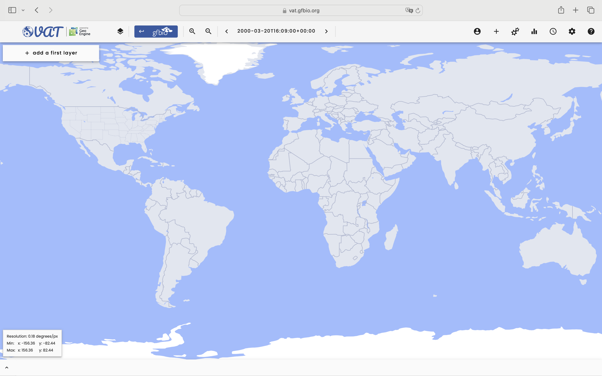
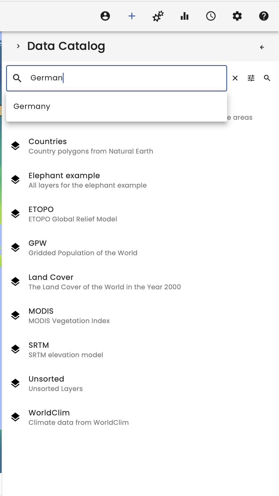
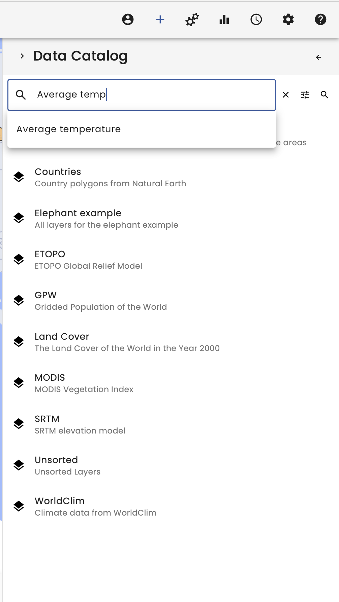
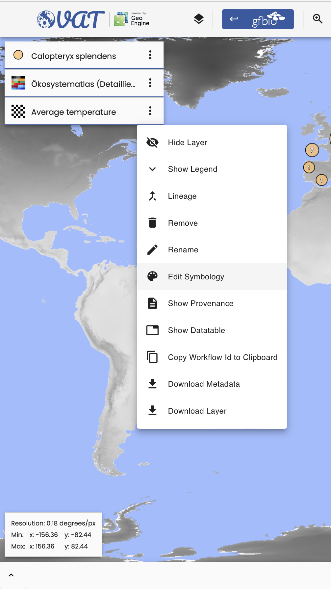
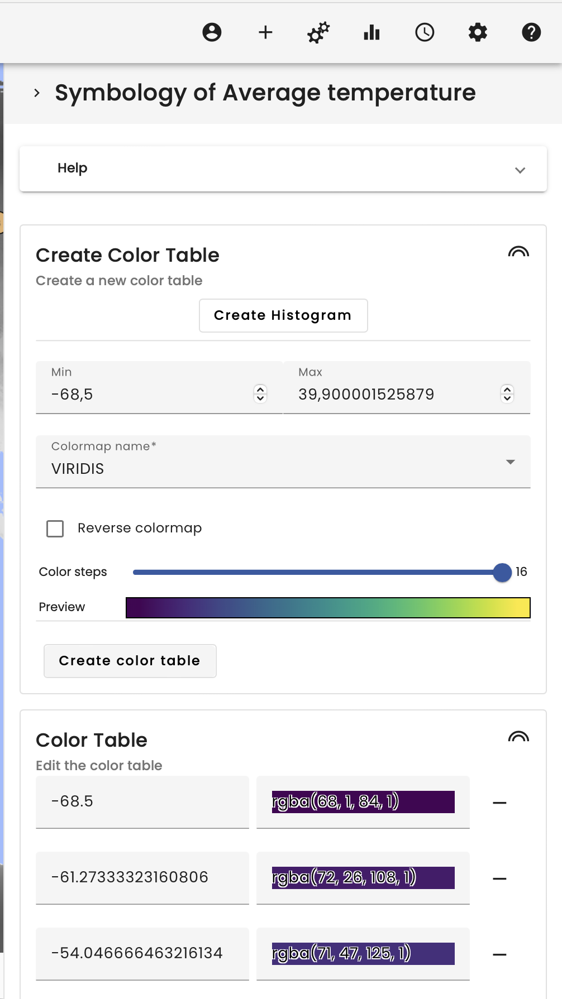
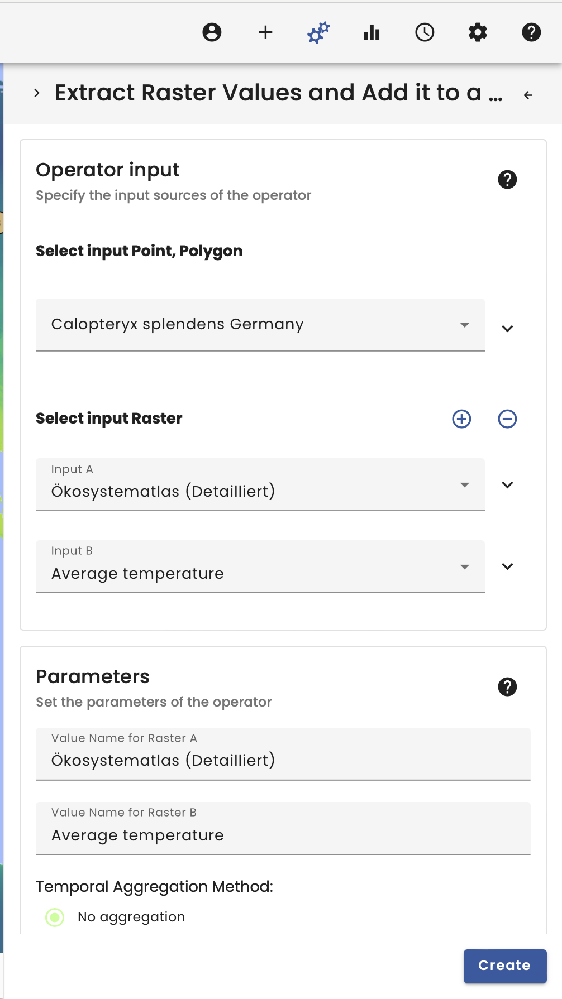
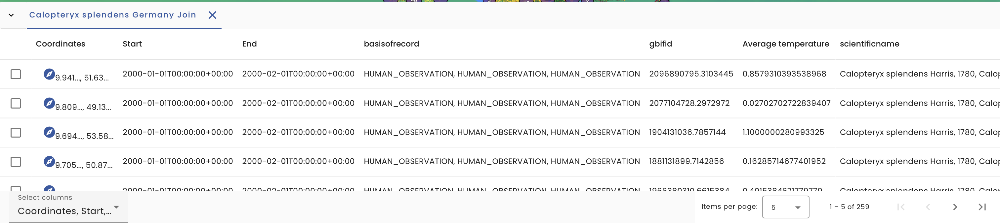

# Auf dem Trockenen

## Video

**_TODO_**

## Summary

Welcome to the Use-Case Auf dem Trockenen.

In this example the GBIF occurence data of Calopteryx splendens will be cut to the extent of Germyn and joined by the land use classification of the Oekosystematlas as well as a time of the average temperature provided by the WorldClim dataset.

To begin, we select the data catalog in the top right corner. In here we have multiple data catalogs to choose from.

In our case we start with searching for _Calopteryx splendens_ in the GBIF data provider. Via the search function it is easy to find the species, so we can search for _Calopteryx splendens_ and load the dataset by selecting it.

For the spatial selection we also need the German boundary, which we found using the search function in the data catalog, searching for _Germany_.

Next, for the linkage between the occurence data and the average temperature we searching for the _Average temperature_ dataset in the data catalog.

**Caution**: The _Average temperature_ is a spatiotemporal dataset. Therefore always check the spatial and temporal extent in the metadata.

The _Average temperature_ dataset covers the whole earth and a temporal extent of 1970/01/01 until 2000/12/31. To address this we need to change the time in the time menu in the top right corner.

As the dataset does not look very appealing we changing the color palette of the raster data. This can be done by right-clicking on the layer and select _Edit symbology_.

In the symbology menu we scroll down to _Create color table_ choosing a colormap, like _VIRIDIS_ or _MAGMA_, clicking the _Create color table_ button and confirm it with the _Apply button_ on the bottom of the symbology menu.

For the linkage between the occurence data and the land use classification it is also necessary to load in the _Oekosystematlas_ by searching for it in the Personal data catalog. The personal data catalog contains all datasets, which the user uploads as well as a section with _All Datasets_ which also contains not listed datasets.

The next step takes place in the operator section, which can be found in the top right corner.

First we use a _Point in Polygon Filter_ to limit our occurence data to Germany. For a better readability it is recommended to name the datasets.

Next we join the raster data to the vector data using the _Raster Vector Join Operator_, which takes the occurence data as vector and the Oekosystematlas and Average temperature as raster data.

The result is the vector data joined by the raster data spatially by the position. Therefore new columns in the data table of the vector data are added containing the information.

To visualize the distribution of the occurence data in dependence of the average temperature the _Histogram_ operator can be used.

To visualize classified data it is recommended to use the _Class Histogram_ operator, which translate the numbers of the Oekosystematlas into the respective class names using the metadata.

The plots then show the distribution of the occurences of _Calopteryx splendens_ in denpence of for once the average temperature at the first of january of year 2000 and for second the landuse classification of the Oekosystematlas.

**Warning** The VAT system is mainly for data exploration. When changing the visual map extent, the workflow will be recalculated and the results therefore could be changed! This needs to be considered, when working with the VAT system scientifically. In the bottom left corner also now a new window. This window must be given when working scientifically with the VAT system as it allows for reproducability!

**Tip**: The layers have several options. They can be downloaded to work with the data in other systems. The layers also always have a workflow tree and the _workflow_id_ can be copied to import the workflow in Python directly.
