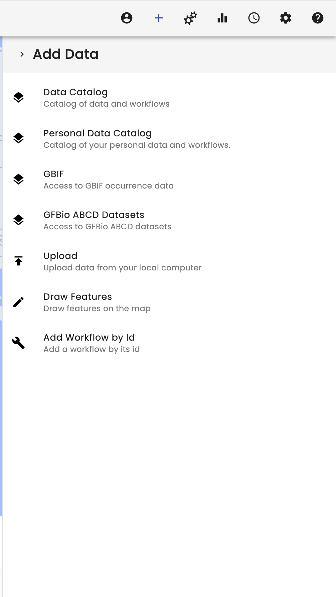
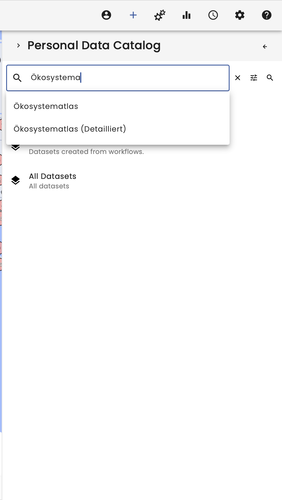
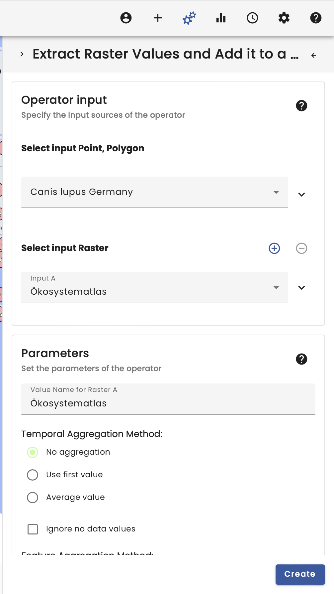
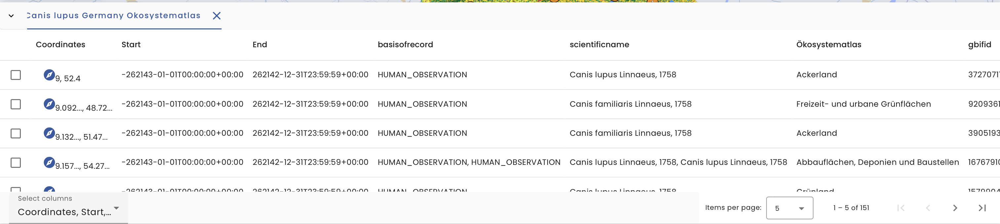
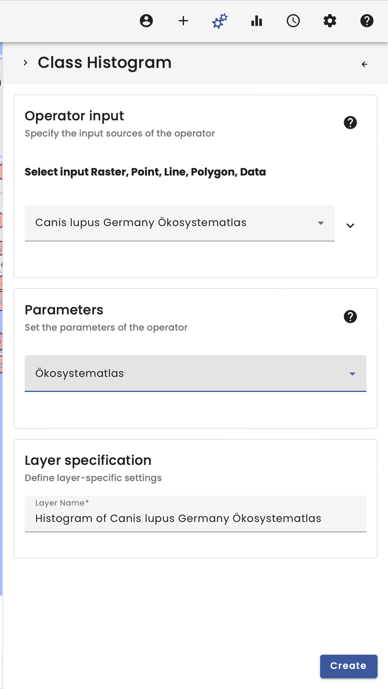

# Canis lupus meets Felis silvestris

## Video

<iframe width="560" height="315" src="https://www.youtube.com/embed/Rdu98FGIiGg" frameborder="0" allow="accelerometer; autoplay; encrypted-media; gyroscope; picture-in-picture" allowfullscreen></iframe>

## Summary

Welcome to the Use-Case Canis lupus meets Felis silvestris.

In this example the GBIF occurence data of Canis lupus and Felis silvestris will be cut to the extent of Germany and joined by the landuse classification of the Oekosystematlas.

To begin, we select the data catalog in the top right corner. In here we have multiple data catalogs to choose from.

In our case we start with searching for the individual species in the GBIF data provider. Via the search function it is easy to find the species, so we search for _Canis lupus_ and loading the dataset by selecting it.

For the spatial selection we also need the German boundaries, which we found using the search function in the data catalog, searching for _Germany_.

For the linkage between the occurence data and the land use classification it is also necessary to load in the _Oekosystematlas_ by searching for it in the Personal data catalog. The personal data catalog contains all datasets, which the user uploads as well as a section with _All Datasets_ which also contains not listed datasets.

The next step takes place in the operator section, which can be found in the top right corner.

First we use a _Point in Polygon Filter_ to limit our occurence data to Germany. For a better readability it is recommended to name the datasets.

Next we join the raster data to the vector data using the _Raster Vector Join Operator_, which takes the occurence data as vector and the Oekosystematlas as raster data.

The result is the vector data joined by the raster data spatially by the position. Therefore a new column in the data table of the vector data is added containing the information.

To visualize classified data it is recommended to use the _Class Histogram_ operator, which translate the numbers of the Oekosystematlas into the respective class names using the metadata.

The plot then shows the respective distribution of the occurences in dependence of the respective class.

Using the same workflow for _Felis silvestris_ it is possible to compare the occurences between the two species.

**Warning**: The VAT system is mainly for data exploration. When changing the visual map extent, the workflow will be recalculated and the results therefore could be changed! This needs to be considered, when working with the VAT system scientifically. In the bottom left corner also now a new window. This window must be given when working scientifically with the VAT system as it allows for reproducability!

**Tip**: The layers have several options. They can be downloaded to work with the data in other systems. The layers also always have a workflow tree and the _workflow_id_ can be copied to import the workflow in Python directly.
