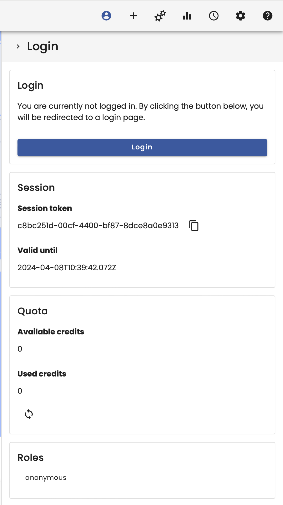
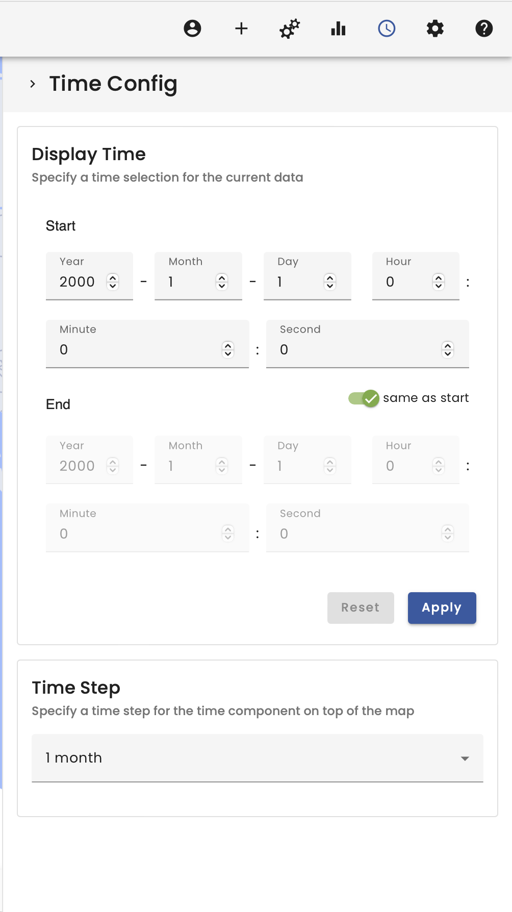
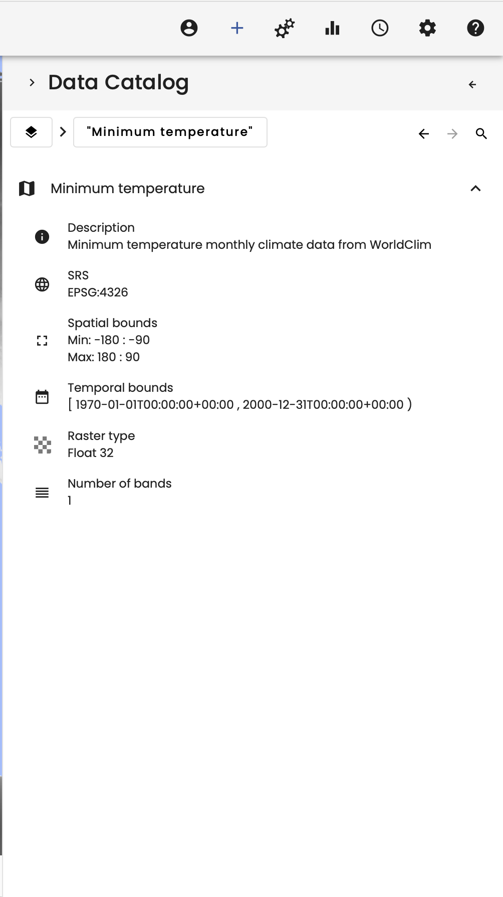
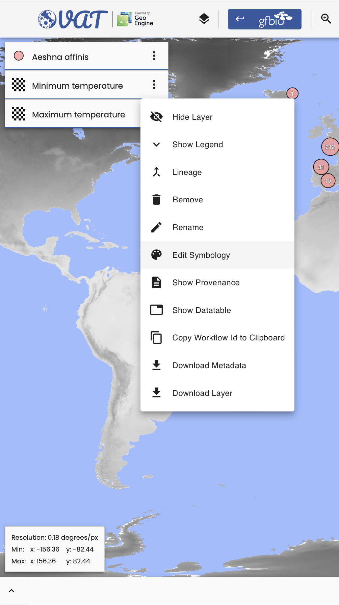
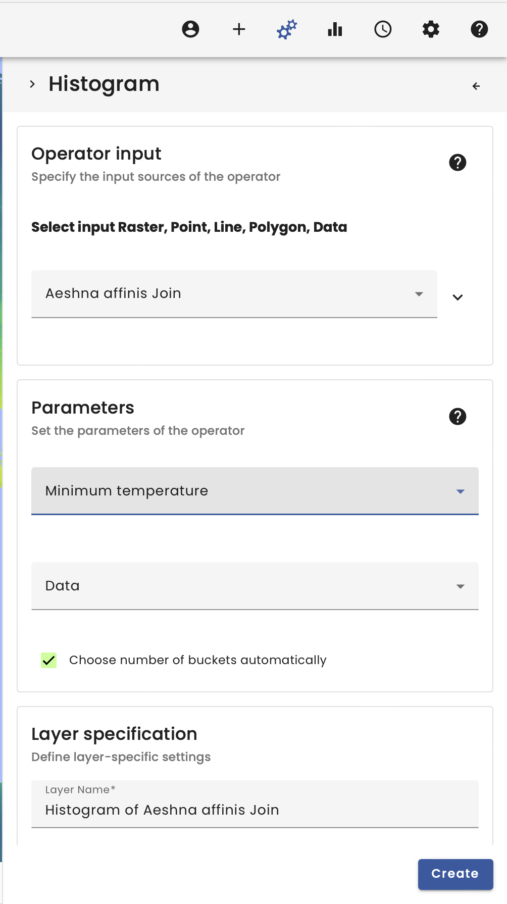
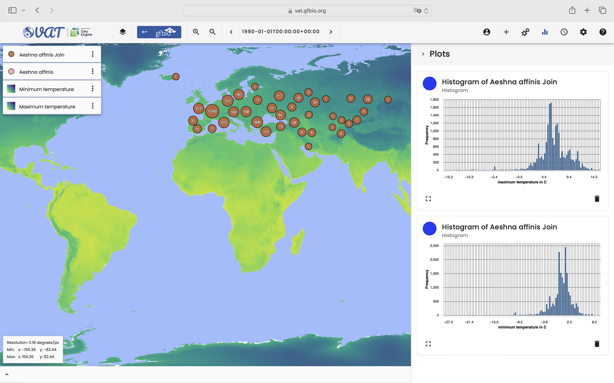

# Einfuehrung in VAT

## Video

**_TODO_**

## Summary

Welcome to the Introduction in VAT.

This first instruction will introduce you to the VAT system, which can be used to easily load, transform and explore spatiotemporal datasets like in the context of of ecology science. This introduction will give you a tour around, explain every menu and show the functionality in a simple first Use-Case, where we spatially join the minimum and maximum temperature with the GBIF occurence data from _Aeshna affinis_.

Lets begin with the tour!

The most prominent area when opening the https://vat.gfbio.org link is the large map. Here you can visualize the spatiotemporal data. The map extent can be changed by shifting it using the mouse or zooming using the scroll wheel.

Next in the top left corner you find the layer selection menu, in here you see all the currently loaded layers, change the symbology or arrange the layers. In addition, you find here the option to show the provenance, data table or also download the layer.

In the top bar most left you find the GFBio Portal button, which brings you back to the GFBio Search. Because of the deep integration between the VAT and the GFBio search it is possible to load data directly from the GFBio search. This button brings you back to the GFBio search, when you finished your data exploration.

Next to the GFBio button you find a zoom manipulation menu. Beside the scroll wheel can the zoom level be changed by the maximizing and minimizing button.

In the middle of the top bar is the time step selector. When inspecting spatiotemporal data you may wish to change the time by a time step. This menu can be used to shift the current time step or opening the time selection, which we see in a bit.

In the right of the top bar you find a bunch of icons, which we visit next.

The first icon shows the account menu. Here you are able to log in with your GFBio account, which enables you to upload files or create, save or export a project. Here you also find the session token, which can be used in Python to visit loaded files.

The next menu is the data selection menu. Here you find several data catalogs. The data catalog contains datasets hosted by the GeoEngine, which contains in example land use classification, climate information or orographic height maps. The personal data catalog contains all the files and workflows as well as all datasets data catalog, which contains all hosted and uploaded datasets. Beneath are the GBIF and GFBio ABCD data catalogs, which contains all datasets derived from the respective data providers. It is also possible to draw features or load a layer by inserting the workflow_id from a Python workflow.

The gears icon hides the operator selection menu. Here you find multiple operator to manipulate vector or raster data, transform or join them or to visualizing the data via plots.

The plots then are shown in the plot window. Here you see plotting results and delete the plots.

The next menu is the time configuration menu. Here you can filter spatiotemporal data. It is also possible to change the time step witdth of the time step selector.

In the workspace settings you can, when logged in, save and load projects as well as change the spatial reference of your project.

The last menu is the help section. Here you find first information and links to the documentation of the geoengine and more provernance information about the VAT.

After this brief tour lets start with an example workflow to show the capabilities of the VAT.

First we go into the data selection menu and search for _Aeshna affinis_ in the GBIF data catalog. By clicking on the file we load the layer into the map.

For the linkage between the occurence data and the average temperature we searching for the _Minimum temperature_ dataset in the data catalog.

The _Minimum temperature_ dataset is a spatiotemporal dataset and has therefore a spatial and temporal extent. This can be found in the metadata of the dataset.

To address the temporal extent we change the time in the time configuration menu.

We also load the _Maximum temperature_ dataset.

As the visual appearence of the temperature datasets are not appealing, we change the symbology of the raster layer.

When clicking on _Edit symbology_ we were guided to the edit symbology menu. Here we scroll down, choose a different colormap like _VIRIDIS_ or _MAGMA_ and click on _Create color table_. Finally we confirm the change with the _Apply_ button on the bottom of the menu.

After loading the data, we want to spatially join the occurence data of _Aeshna affinis_ with the _Minimum temperature_ and _Maximum temperature_ dataset using the _Raster vector join_ operator. For a better readability it is recommended to name the datasets.

The result is the vector data joined by the raster data spatially by the position. Therefore new columns in the data table of the vector data are added containing the information.

To visualize the distribution of the occurence data in dependence of the temperatures the _Histogram_ operator can be used.

The plots then show the distribution of the occurences of _Aeshna affinis_ in denpence of the minimum and maximum temperature at the first of january of year 1990.

When you are finished with manipulating the data it is possible to download the raster data as .tif and the vector data as .shp files in the layer selection menu.

In the menu it is also possible to show the provenance, which then appear in the data table area at the bottom of the VAT.

This was the first introductary tour around the VAT system. When you want to learn more you are be able to do so by watching the videos or explore the Use-cases in this documentation. As well as visit ... and ... for more information.

**Warning** The VAT system is mainly for data exploration. When changing the visual map extent, the workflow will be recalculated and the results therefore could be changed! This needs to be considered, when working with the VAT system scientifically. In the bottom left corner also now a new window. This window must be given when working scientifically with the VAT system as it allows for reproducability!

**Tip**: The layers have several options. They can be downloaded to work with the data in other systems. The layers also always have a workflow tree and the _workflow_id_ can be copied to import the workflow in Python directly.
